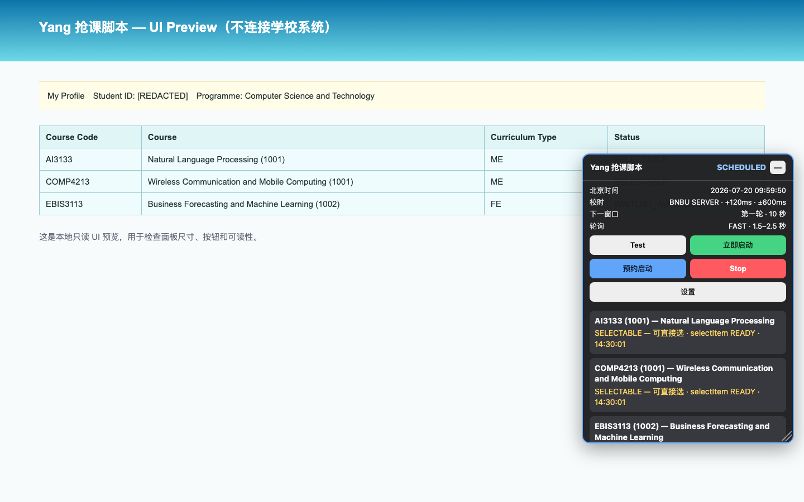
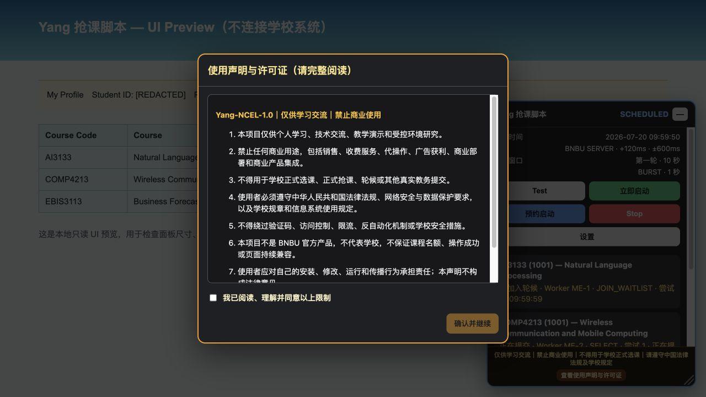

# Yang 抢课脚本

[](https://github.com/Yang1107-wzy/yang-bnbu-course-assistant/actions/workflows/ci.yml)
[](https://github.com/Yang1107-wzy/yang-bnbu-course-assistant/releases/latest)
[](./LICENSE)

> [!CAUTION]
> **仅供学习交流，禁止商业使用，不得用于学校正式选课、正式抢课、轮候或其他真实教务操作。使用者必须遵守中华人民共和国法律法规、网络安全与数据保护要求、学校规章及信息系统使用规定。** 本项目不是 BNBU 官方产品，不代表学校，不保证课程名额或操作结果。
>
> **Learning and controlled testing only. Commercial use and use for formal school course selection or other live academic-affairs operations are prohibited. Follow applicable Chinese laws, school rules, and system policies.**

面向 BNBU MIS 的 Chrome + Tampermonkey 可视化选课与轮候助手。支持立即启动、北京时间预约、自动识别 Select、Select from Waiting 和 Join Waiting List。

> **English:** A source-available Tampermonkey learning project for controlled DOM and workflow research. It works only in an already authenticated browser session and never handles credentials or CAPTCHA.



首次运行会显示完整声明，确认前保持 `STOPPED`：



## 重要说明

- 本项目仅供个人学习、技术交流、教学演示和受控环境研究；禁止商业使用和收费服务。
- 不得用于学校正式选课、正式抢课、轮候或其他真实教务提交。
- 本项目不是 BNBU 官方产品，使用者必须自行遵守中华人民共和国法律法规、学校规章和系统使用政策。
- 软件不保证课程名额或最终选课结果。正式页面可能随时变化，应先使用 `Test` 检查。
- `v1.2.2` 已通过自动化 DOM、页面函数、Hot Page、Worker 租约、合规确认和面板布局测试，但未在学校正式选课窗口执行真实提交验收。
- 公开版默认预填 AI3133、COMP4213 和 EBIS3113；其他使用者安装后必须先在 `设置` 中替换为自己的目标。

## 功能

- `Test`：立即扫描当前页面并返回结果，不等待后台 Worker 加载，也不执行选课。
- `立即启动`：先进入 RUNNING 并扫描已打开的详情页；校时和缺失 Worker 预热异步进行，不阻塞当前页动作。
- `预约启动`：根据可编辑的北京时间窗口自动开始、跨轮次暂停和恢复。
- `Stop` / `Esc`：停止刷新、清空待提交动作并同步所有 worker 标签。
- 手动打开的 ME/FE 详情页是前台优先页，一次遍历本类别所有目标；默认三个专用 Worker 只作缺页、跳转或失联时的兜底。
- 多门同时可操作时进入跨标签 FIFO，以至少 250 ms 间隔快速串行提交。
- 状态卡明确区分“已加入轮候”“已抢到”“执行失败”和“Worker 失联”。
- 只允许 `selectItem`、`selectItemFromWaiting`、`joinWaiting`。
- 不检查本地学分或轮候人数；是否成功以 MIS 返回结果为准。
- 面板可拖动、右下角自由缩放，并可收起成可拖动的 `Yang` 悬浮按钮。

## 安装

### 一键安装

1. 在 Chrome 安装并启用 [Tampermonkey](https://www.tampermonkey.net/)。
2. 打开 [`yang-bnbu-course-assistant.user.js`](https://raw.githubusercontent.com/Yang1107-wzy/yang-bnbu-course-assistant/main/dist/yang-bnbu-course-assistant.user.js)。
3. Tampermonkey 显示安装页面后，确认名称为“Yang 抢课脚本”、版本为 `1.2.2`、许可证为 `Yang-NCEL-1.0`，再点击安装。

### 手动安装

1. 打开 Tampermonkey 管理面板并新建脚本。
2. 将 [`dist/yang-bnbu-course-assistant.user.js`](./dist/yang-bnbu-course-assistant.user.js) 的完整内容粘贴进去并保存。
3. 只启用一个版本，避免旧脚本和新脚本同时运行。

## 首次使用

1. 登录 [BNBU MIS](https://mis.bnbu.edu.cn/mis/login.jsp)，进入选课状态页。
2. 完整阅读首次使用声明，滚动到底并勾选确认。确认前只允许 `Test` 和设置，不允许启动或自动动作。
3. 打开面板的 `设置`，确认默认目标是否正是 AI3133 (1001)、COMP4213 (1001) 和 EBIS3113 (1002)。
4. 如目标不同，逐门填写：课程代码、MIS 页面显示的完整名称、四位班号、类别 `ME` 或 `FE`。
5. 保存后刷新页面，点击 `Test`。
6. 可先手动打开 ME/FE 详情页；脚本会把它识别为前台优先页。点击 `Test` 核对目标。

课程代码、完整名称和班号必须同时精确匹配。相似名称、重复行或未知函数一律不会执行。

## 面板布局

- 按住标题栏空白位置拖动面板；按钮和输入框不会触发拖动。
- 拖动右下角斜线手柄可同时调整宽度和高度。
- 点击标题栏的 `—` 收起，面板会变成小型 `Yang` 悬浮按钮；点击 `↗` 展开。
- 位置、尺寸和收起状态会跨页面、刷新和浏览器重启保存。
- 若面板位置异常，可在 Tampermonkey 菜单选择 `显示/展开 Yang 面板` 或 `重置 Yang 面板位置`。
- 收起面板不会停止正在运行的监控、预约或自动选课；只有 `Stop` 或 `Esc` 会停止。

## 两种启动方式

### 立即启动

点击 `立即启动` 后先进入 `RUNNING`。已经打开的手动 ME/FE 详情页会作为前台优先页立即遍历本类别目标；发现 Select、Select from Waiting 或 Join Waiting List 就直接进入共享动作队列。服务器校时与缺失 Worker 创建在后台异步进行，不阻塞当前页面。专用 Worker 的普通阶段每 3 秒刷新，开放前 30 秒至开放后 2 分钟每 1 秒刷新。

### 预约启动

默认北京时间窗口：

| 轮次 | 开始 | 结束 |
|---|---|---|
| 第一轮 | 2026-07-20 10:00:00 | 2026-07-20 13:00:00 |
| 第二轮 | 2026-07-20 15:00:00 | 2026-07-20 18:00:00 |
| 第三轮 | 2026-07-21 10:00:00 | 2026-07-22 18:00:00 |

点击 `预约启动` 后进入 `SCHEDULED`。脚本会提前打开并校验 Worker，不等到 10:00 才加载页面；开放前 30 秒进入 1 秒冲刺，开放 2 分钟后仍不可选则恢复 3 秒刷新。预约期间仍可点击 `立即启动` 提前开始。

## Worker 与课程状态

- 状态页是唯一完整控制中心；自动 Worker 和手动前台优先页只显示只读迷你状态条。
- `已加入轮候`不是终态：脚本继续监控 `Select from Waiting`。
- `已抢到`才是终态：停止该目标刷新并保留成功状态。
- `执行失败`会显示动作、原因、尝试次数和最近扫描时间，不会伪装成仍在提交。
- `STOPPED` 时前台优先页只识别；只有立即启动或预约窗口进入 RUNNING 后才会提交。

校时优先读取 BNBU 同源页面的 HTTP `Date`；若服务器不提供，则明确显示本机北京时间兜底，不连接第三方时间服务。

## 更新与卸载

- Tampermonkey 会根据 GitHub Raw 地址检查版本更新。
- 更新后应刷新所有 MIS 标签，并再次运行 `Test`。
- 卸载时在 Tampermonkey 管理面板删除“Yang 抢课脚本”；它不会删除或修改 MIS 中已经完成的选课记录。

## 常见问题

### 页面没有面板

确认网址是 `https://mis.bnbu.edu.cn/mis/student/es/elective.do` 或 `eleDetail.do`，脚本已启用，并强制刷新页面。也可从 Tampermonkey 菜单选择 `显示/展开 Yang 面板` 或重置面板位置。

### 显示未找到或 UNKNOWN

重新核对完整课程名称与班号。若 MIS 页面结构变化，保持 `STOPPED`，按照 [`docs/DOM_CAPTURE_GUIDE.md`](./docs/DOM_CAPTURE_GUIDE.md) 获取脱敏诊断。

### 点击启动后没有提交

查看对应课程状态卡。登录过期会全局停止；确认文字变化、页面函数不存在或目标不唯一会显示明确的“执行失败”，不会盲目操作。

## 安全边界

- 仅供学习交流和受控环境测试；禁止商业使用及学校正式选课用途。
- 不保存登录信息、Cookie、Token、姓名、学号或隐藏表单值。
- 不自动登录、不处理验证码、不调用隐藏选课 API、不使用 `GM_xmlhttpRequest`。
- 永不执行 Replace、Drop、Exit Waiting 或未知函数。
- 随机抖动只用于标签错峰，不用于规避限流或反检测。

更多细节见 [`docs/SECURITY_BOUNDARIES.md`](./docs/SECURITY_BOUNDARIES.md) 和 [`SECURITY.md`](./SECURITY.md)。

## 开发与验证

需要 Node.js 20 或更新版本：

```bash
npm ci
npm run check
npm run package
```

测试、ESLint、单文件构建、安全审计和 Release 打包均由 GitHub Actions 重复执行。贡献前请阅读 [`CONTRIBUTING.md`](./CONTRIBUTING.md)。

## License

[Yang Non-Commercial Educational License 1.0 (Yang-NCEL-1.0)](./LICENSE) © 2026 Yang1107-wzy

这是自定义的源码可见、非商业许可证，允许在相同许可证和署名条件下进行非商业学习、修改和再分发。It is not an OSI-approved open source license. 本项目文档不构成法律意见。
